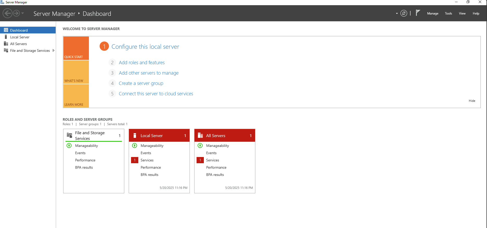
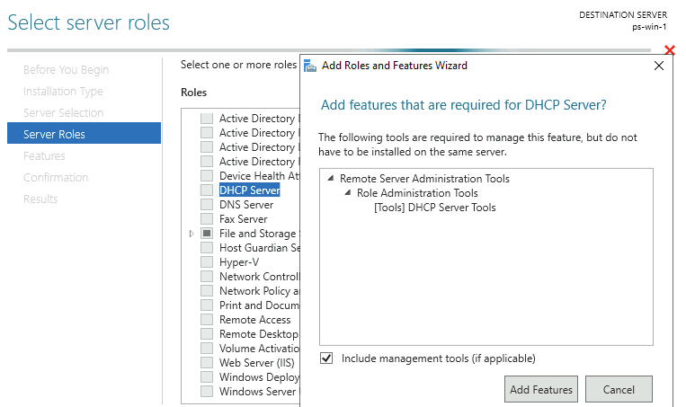
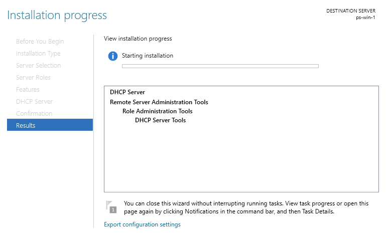
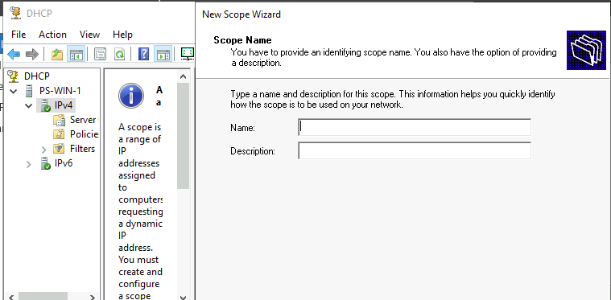
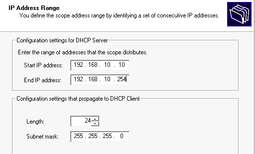
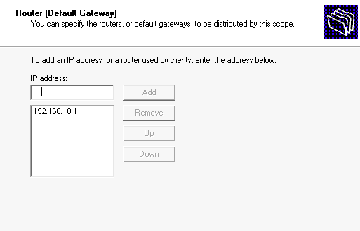
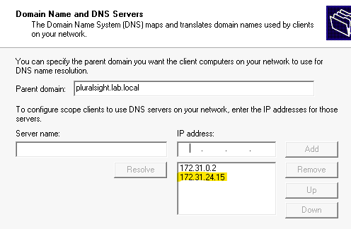
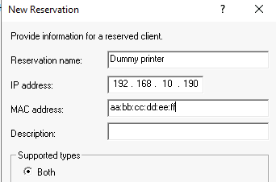

# Install and Configure DHCP in a Windows Server Environment

## Overview
This project demonstrates installing and configuring a DHCP server on Windows Server. DHCP automates the assignment of IP addresses and other network settings to client devices, which is essential for scalable network administration.

## Objectives:
- Installation of the DHCP Server role
- Configuration of an IP scope
- Setting up the default gateway and DNS options
- Creating a DHCP reservation for static IP assignment

---

## Tools Used
- Windows Server 2022 (GUI)
- Server Manager
- DHCP MMC Snap-In
- Pluralsight Lab Environment

---

## Objectives
- Install DHCP Server role via Server Manager
- Create and configure an IPv4 scope
- Set up DHCP options, including gateway and DNS
- Add an IP reservation based on MAC address

---

## Scope Configuration

| Setting                     | Value                       |
|----------------------------|-----------------------------|
| **Scope Name**             | 192.168.10.0/24             |
| **Start IP**               | 192.168.10.10               |
| **End IP**                 | 192.168.10.254              |
| **Subnet Mask**            | 255.255.255.0               |
| **Default Gateway**        | 192.168.10.1                |
| **DNS Domain**             | pluralsight.lab.local       |
| **DNS Server IP**          | 172.31.24.15                |
| **Lease Duration**         | 8 days (default)            |

---

## Screenshots

| Description                  | Image Path                       |
|------------------------------|----------------------------------|
| Server Manager Dashboard     |  |
| Add DHCP Server              | |
| DHCP Role Installation       |      |
| DHCP Console/Add Scope       |      |
| Scope Configuration Window   |          |
| Default Gateway              ||
| DNS Server                   |          |
| DHCP Reservation Setup       |  |

---

## DHCP Reservation Example

**Dummy Printer Reservation:**

| Setting           | Value              |
|------------------|--------------------|
| **Reservation Name** | Dummy printer     |
| **IP Address**       | 192.168.10.190    |
| **MAC Address**      | aa:bb:cc:dd:ee:ff |

> This reservation ensures that any device with the MAC address `aa:bb:cc:dd:ee:ff` will always receive the IP address `192.168.10.190`.

---

## What I Learned
- How to add server roles and features in Server Manager
- Creating and managing DHCP scopes in Windows
- Understanding the importance of DNS and default gateway options
- How DHCP reservations work and when to use them (e.g. printers, servers)
- The fundamentals of DHCP leasing and scope exclusions

---

